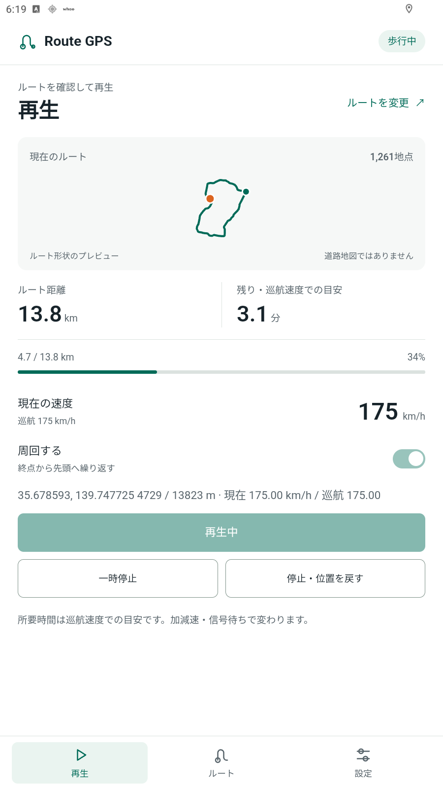

# Route GPS

指定したルートに沿って、Androidの位置情報を動かす疑似GPSアプリです。GPXやGoogle Mapsの経路を取り込み、速度・加減速・信号待ちを設定して再生できます。

**[最新版をダウンロード](https://github.com/jyup-escape/route-gps/releases/latest)**

Releasesの「Assets」から `RouteGPS-バージョン.apk` をダウンロードしてください。ビルド元のソースZIPも同じページにあります。

<p align="center">
  
</p>

## できること

- GPXファイルの読み込み・保存
- Google Mapsの共有リンクからルート候補を取り込み
- 緯度・経度を指定して、道路に沿う徒歩ルートを作成
- 巡航速度、加速度、減速度、速度の揺らぎを調整
- 信号の位置を取得し、設定した確率で減速・停止・発進
- 一時停止、停止、ルートの周回再生

地点数・距離・GPXサイズにアプリ独自の固定上限はありません。扱える大きさは端末の空きメモリや保存容量によって変わります。

## インストール

Android 8.0以上が必要です。

1. ReleasesからAPKをダウンロードしてインストールします。インストール許可を求められた場合は、使用したブラウザやファイル管理アプリを許可してください。
2. Androidの開発者向けオプションを開き、「仮の現在地情報アプリ」に **Route GPS** を選びます。開発者向けオプションが表示されない場合は、端末情報の「ビルド番号」を7回タップして有効にします。項目名は端末によって異なります。
3. Route GPSを開き、位置情報の権限を許可します。

配布APKは同じ署名鍵を使用しているため、以前の配布版に上書き更新できます。疑似位置情報が他のアプリに反映されるかは、端末環境と受け取るアプリの対応によります。

## 使い方

### ルートを読み込む

「ルート」画面でGPXファイルを選ぶか、Google Mapsの共有リンクを貼り付けて候補を取得します。Google Mapsの共有メニューからRoute GPSへ送ることもできます。

Google Mapsから取り込む場合は、表示された距離と候補名を元の経路と見比べて選んでください。共有リンクだけでは、共有画面で選ばれていた候補を判別できません。取得時にGoogle側で経路が再計算されることもあります。

### 速度を設定して再生する

「再生」画面で巡航速度と周回の設定を確認し、再生を開始します。加減速や速度の揺らぎ、信号待ちは「設定」画面で調整できます。再生中は現在速度と移動距離、進捗が表示されます。

一時停止・停止では減速してから止まります。設定を変更する場合は、先に再生を停止してください。

詳しい入力形式や信号の設定は **[使い方](docs/usage.md)** を参照してください。

## 取り込みと表示について

- Google Mapsの取り込みにAPIキーは不要ですが、非公式のWeb経路形式を利用しています。Google側の仕様変更や通信状況によって取得できない場合があります。取得に失敗しても、別サービスの道筋へ自動で置き換えません。
- GPXは1つのトラック区間、またはルートを読み込みます。記録された時刻・速度・標高は再生に使用しません。
- プレビューはルートの形状図です。道路地図や現在の交通状況は表示しません。残り時間は巡航速度での目安で、加減速や信号待ちを含みません。
- 信号待ちは確率によるシミュレーションです。実際の信号の色とは連動しません。
- 電車の経路・実際の時刻表に合わせた再生は未対応です。

Google Mapsの取り込みではリンクと経由地をGoogleへ送信します。座標からの道路検索にはOSRM、信号位置の取得にはOverpassを使用し、それぞれ入力座標やルート情報を送信します。

## ソースからビルドする

Windows、Python 3、ネットワーク接続が必要です。

```powershell
python setup_tools.py
python build.py
```

必要なAndroid SDKとJDKはプロジェクト内の `tools` に取得します。ビルド時にAPKの署名・検証まで行います。生成した署名鍵 `tools/routegps.keystore` は、同じアプリを更新するために保管してください。自分でビルドしたAPKは署名が異なるため、配布APKへの上書き更新には使えません。

`python package.py` を実行すると、`releases/バージョン/` にAPKとソースZIPを作成します。

[変更履歴](CHANGELOG.md) · [ブランチとバージョン管理](docs/versioning.md)

## 使用データ

道路検索：OSRM / FOSSGIS。信号位置：OpenStreetMap / Overpass。

地図データ © [OpenStreetMap contributors](https://www.openstreetmap.org/copyright)（ODbL）。
